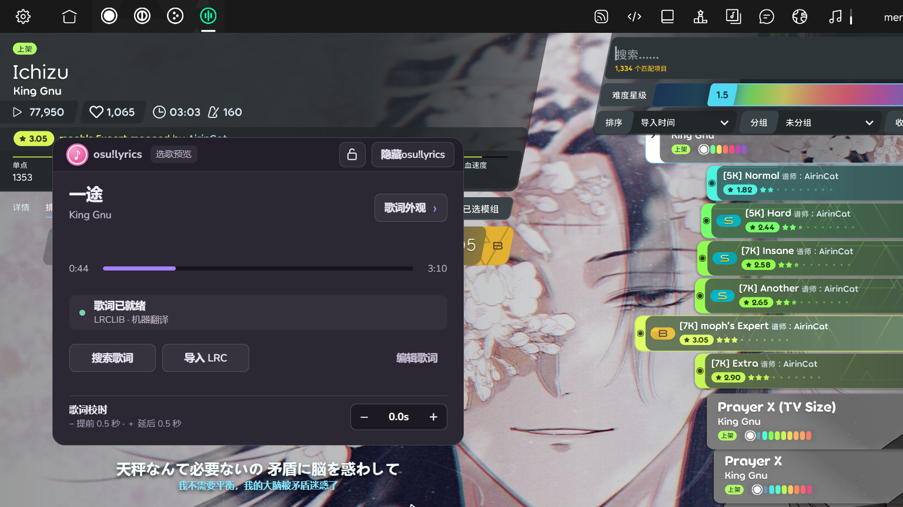

# osu!lyrics

[English](README.en.md) [Blog](https://meredith2328.github.io/posts/toy/osu-lyrics.html)

> Windows SmartScreen 可能会显示已阻止无法识别的程序运行，直接点“仍要运行”即可。

给 osu!lazer 用的 Windows 悬浮歌词工具。

它在游戏外运行，通过 [tosu](https://github.com/tosuapp/tosu) 读取当前谱面与播放位置，通过 [LRCLIB](https://lrclib.net/docs) 搜索歌词，通过 [Google Translate](https://docs.cloud.google.com/translate/docs/api-overview?hl=zh-cn) 翻译歌词为中文。

## 使用

1. 从 Releases 下载 osu-lyrics-x.x.x-portable.exe，双击运行（无需安装 Node.js）。当前包未签名，Windows 可能提示「未知发布者」，点继续运行即可。

2. 打开 osu!lazer。首次使用若提示缺少 tosu，点「安装」，程序会自动下载固定版本。

3. 根据自己喜好调整一下配置，然后**点击面板右上角的 ⌄ 收起配置界面，开始 osu! 吧！**

### 歌词与控制面板

- 歌词界面：播放或预览歌曲时，工具会自动查找同步歌词。没找到时可搜索其他版本、导入 LRC (歌词文件)，或手动编辑。

- 移动 / 缩放：拖动歌词或面板本体可移动位置，拖动边缘可缩放。

- 锁定：点击面板右上角的锁图标锁定当前位置。

- 收起 / 展开：点面板右上角的 ⌄ 收起控制面板，只留下歌词和左侧的**粉色音符**；点粉色音符再展开。

- 设置菜单：面板左上角的设置按钮里有「完全隐藏」「锁定位置」「退出」，和任务栏图标的菜单一样。

- 校时：「−／＋」每次调整 0.5 秒。

- 歌词外观：可调大小、透明度、颜色、排版和中文翻译，顶部有四种快捷色样。初次运行默认白粉色样，上图演示冰蓝色样。

- 保存：位置、样式、锁定状态与校时会保存在本机，重启后保留。

### 显示与退出

- 显示 / 隐藏：Ctrl+Alt+Shift+L 切换整个悬浮窗口；也可以用设置菜单或右键任务栏小图标。

- 退出：设置菜单或任务栏小图标 → 退出。

- 升级：0.4.12 及更早版本保存的歌词和校时会在第一次打开对应歌曲时自动迁移。

- 若快捷键被其他软件占用，仍可通过任务栏小图标控制。

## 面向开发者

本地配置与歌词放在 `%APPDATA%\osu-lyrics-companion`。**日常使用更推荐release的便携 EXE**，无需安装 Node.js。

`start.cmd` 和 `start.ps1` 仅供从源码运行。

前者可双击使用，后者可执行 `powershell -ExecutionPolicy Bypass -File .\start.ps1` 使用。

二者会在首次运行时安装依赖。

源码测试应使用 `npm test`。

- [Electron](https://www.electronjs.org/) 提供透明置顶窗口、通知区域图标与全局快捷键。工具不会向 osu! 注入代码。EXE 的体积主要来自附带的 Chromium/Node.js 运行时；打包时只保留英、简中、繁中和日文语言资源。
- [tosu](https://github.com/tosuapp/tosu) 作为独立本机程序，提供 osu!lazer 的曲目、谱面时间、暂停与改速信息；本工具从 `127.0.0.1:24050/json/v2` 读取，按游戏报告的时间轴同步歌词。
- [LRCLIB](https://lrclib.net/docs) 提供带时间戳的 LRC。匹配时综合曲名、歌手、时长与语言；本地导入或编辑的歌词优先。缺少中文时可调用 Google 翻译的非官方网页接口生成译文，使用该功能时歌词文本会发送给 Google，服务可能变动或不可用。
- 窗口字体附带 [Nunito Sans](assets/fonts/OFL.txt)（SIL Open Font License）；粉色音符图标由本仓库脚本绘制。未打包游戏字体、音频、谱面或歌词。

## 版权与用途

这是非官方的个人游玩辅助工具，与 osu!、ppy 或相关创作者没有隶属或背书关系。**osu! 名称、标识及游戏素材归 osu!/ppy 等相应权利人；歌曲、封面、谱面和歌词分别归其作者及权利人。** 请勿把从歌词服务取得的内容当作本仓库授权的可再分发素材。本工具仅为方便游玩而制作，不提供或转售游戏与歌曲内容；具体权利以 [osu! 的音乐授权说明](https://osu.ppy.sh/legal/en/Music_licensing) 和各素材许可为准。
