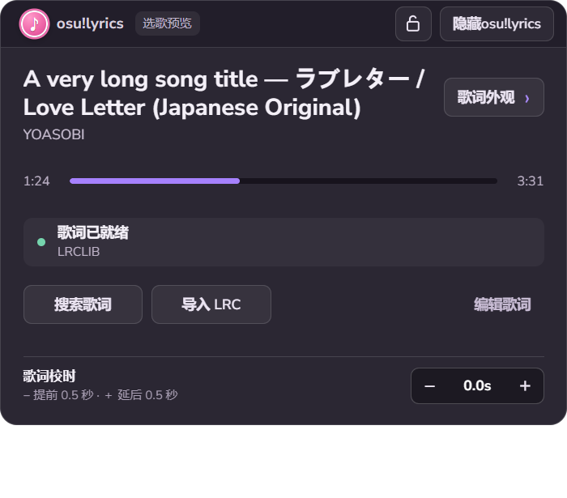
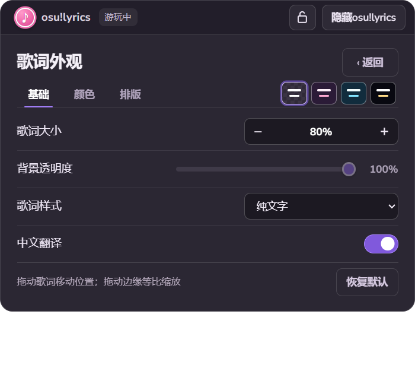
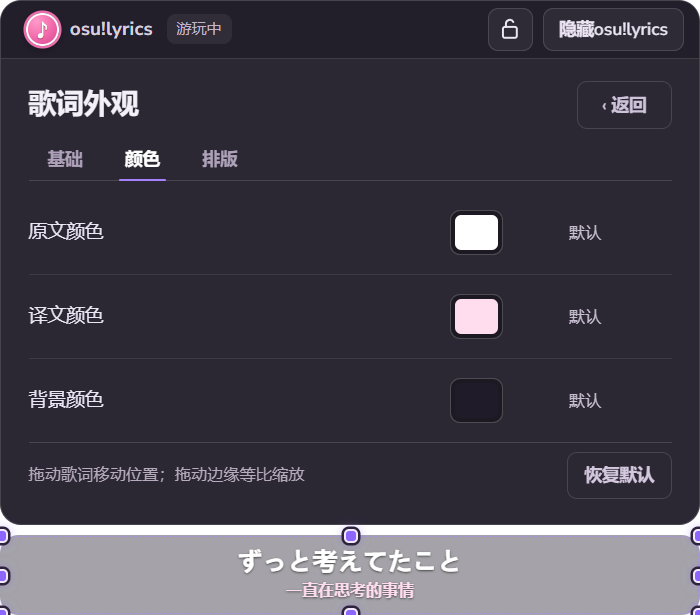
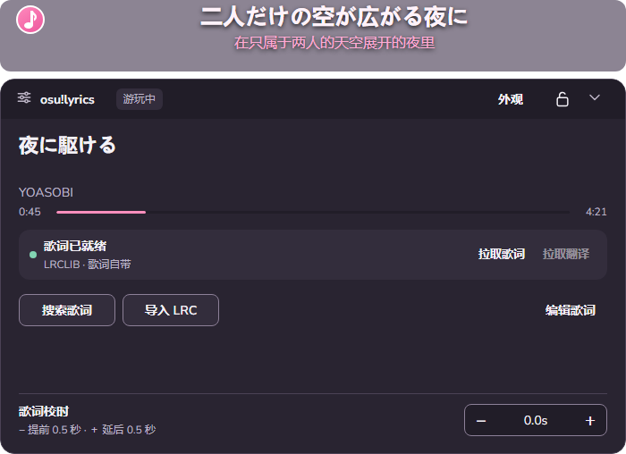
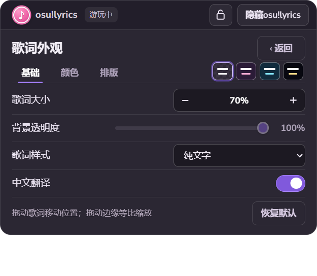

# 悬浮歌词控制面板设计

目标：在展开的面板中看清歌曲、歌词状态与外观参数；收起后只留下歌词与展开音符。

## 原界面的三个结构问题

1. 三个彩色大按钮比歌名和歌词状态更抢眼。用户需要先辨认操作，才能确认工具是否已经找到当前歌曲的歌词。
2. 外观页把四项设置都装进独立的窄卡片。重复的英文小标题、中文标题、品牌和提示争夺同一块空间，标签与控件没有稳定的扫描边界。
3. 面板原本固定在 260 像素高，歌词缩放还会影响面板尺寸。字号、行高、按钮和间距一起被压缩，单纯拉宽无法改善阅读。

## 两页共用的骨架

首次展开的面板高 420 像素，宽度随歌词变化，但保持在 560–720 像素之间。面板与歌词左边界对齐，让粉色音符能在两者之间竖直移动；贴近屏幕边缘时面板仍以可见区域为限，歌词的屏幕位置不变。面板内字号和控件不跟着歌词缩放。顶部 46 像素放轻量品牌、播放阶段、图标锁与隐藏按钮；粉色音符兼作收起入口。收起时面板先缩到固定的顶部音符，音符再竖直移动至歌词左上角，展开时反向执行。下方两页使用同一内容边距、标题字级、控件高度与返回方式。切换页面时面板尺寸不变。

面板顶部空白区域承担移动手柄；边框的八个方向承担缩放手柄。两种手势沿用歌词的位置和缩放计算，因而拖动标题栏会带着歌词一起走，边框缩放会让歌词与面板一起改变尺寸。面板尺寸单独持久化，范围是 500×370 至 1200×600 像素；接近下限时只收紧间距和字号层次，保留正常可读的控件，不出现纵向滚动条。点击“锁定位置”后，两种手势都不可用。

- **主界面第一眼：** 可读两行的歌名；第二眼：歌手、进度与歌词状态；第三眼：获取歌词、日常控制和校时。
- **外观页第一眼：** “歌词外观”；第二眼：基础、颜色和排版的语义分栏；第三眼：当前分栏内对齐的设置行，以及操作提示与恢复默认。

## 删减与重新分配

- 去掉 `NOW PLAYING`、`APPEARANCE` 等与中文内容重复的小标题，以及覆盖内容区的斜线纹理。只有窗口外壳和歌词状态使用背景区分；设置行由对齐、间距和细分隔线组织。
- 搜索和导入保留在同一操作区域；编辑放在右侧，默认仅作轻量文字按钮。歌词缺失或获取失败时才强调搜索。查找中、就绪、缺失和失败共用一个固定高度的状态位，避免整页跳动。
- 进入歌词候选页后，如果曲目 key 改变，立即返回当前新歌的主界面；同一歌曲从选歌预览进入游玩不会触发返回。
- 锁定与隐藏放在顶栏，外观入口贴近歌名；获取歌词与校时仍留在各自的内容位置。图标锁有选中状态，校时明确显示当前偏移以及减号提前、加号延后的意义。
- 外观基础页保留大小、透明度、样式与翻译；新增颜色页分别处理原文、译文和背景，排版页处理字体风格、文字效果和对齐。每页仍共用标签左边界和控件右边界，面板尺寸不因切换而变化。操作提示降为辅助信息，恢复默认留在页脚。真实悬浮歌词就是即时预览，因此没有重复造一个预览卡片。
- 三个分栏上方横排四个小色样，供一键套用清爽、夜樱、冰蓝、聚焦；不新增模板页。模板只组合颜色、背景、字体与文字效果，保留歌词大小、位置及翻译开关；手动修改后选中态消失，表示自定义。
- 界面的“背景透明度”以用户所见为准：100% 表示完全透明；内部保存格式保持原有不透明度数值，因此升级不会改变已有外观。纯文字模式没有背景，滑块显示为不可操作状态。
- 展开面板比旧版更高，会多占一部分游戏画面；收起后仍只显示歌词。这换来正常观看距离下可读的文字和舒适的点击区域。

## 字体和颜色

优先使用用户系统已有的 Torus；便携版内置 [Nunito Sans](https://github.com/google/fonts/tree/main/ofl/nunitosans) 作拉丁字形替代，中文由系统字体补齐。osu! 资源库注明 [Torus 分发需要商业许可](https://github.com/ppy/osu-resources/blob/master/osu.Game.Resources/Fonts/Torus-Alternate/LICENCE)，因此未复制游戏字体。Nunito Sans 的 OFL 许可随字体放在 `assets/fonts/OFL.txt`。

深紫色只做安静的阅读底色，白色与灰紫色承担信息层次。紫色表示当前可操作的强调或开关状态；绿、黄、粉三个小状态点只表示歌词就绪、查找和需要处理。按钮没有各分配一种高饱和色。

## 验证

在实际 Electron 窗口中检查了主界面、外观三个分栏、长歌名、查找中、未匹配、失败、候选结果、歌词缩放 70%/80%/100% 和页面切换。颜色、字体、描边和对齐调整会实时作用到歌词；单色重置、全局恢复默认及本地持久化均经过运行时检查。靠左文字在面板收起时为粉色音符预留空间。系统级鼠标实测确认：拖标题栏只移动歌词与面板；拖右边框让面板由 560×420 变为 616×462，同时歌词由 560×64 变为 616×70；拖左边框再一起缩回。拖上下边框时，被拖的一边跟随指针，对边保持原位。500×370 像素下主界面、外观分栏和候选页都无纵向滚动条。还把实窗截图叠在本机 osu! 画面截图上检查了阅读对比度；这张合成画面仅作视觉检查，未当作真实游戏叠加运行的证明。

